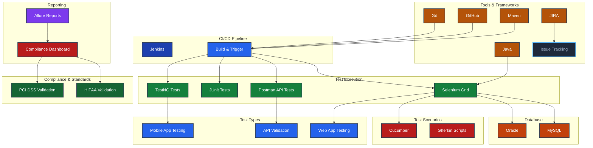
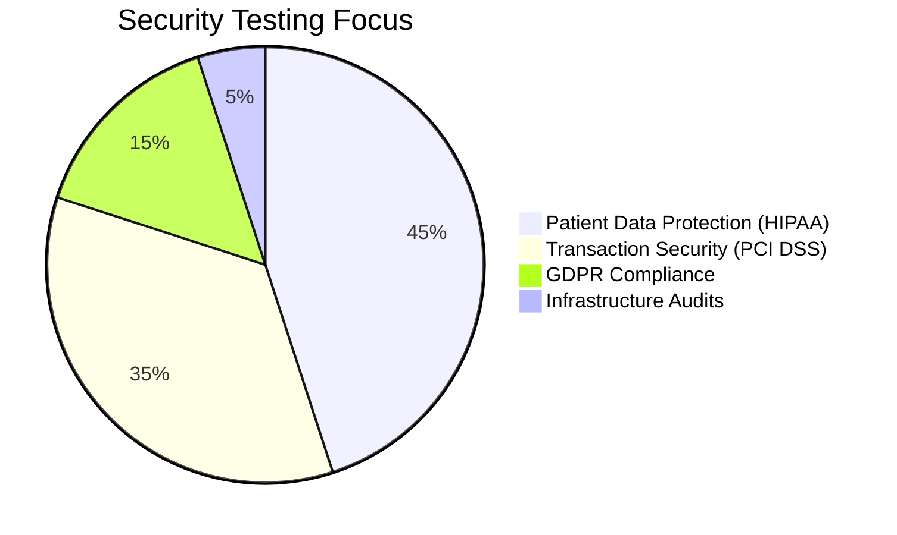

 

 

   

 

## About Me

> *"Located at the crossroads of creativity and excellence — I build automation solutions that transform how products are tested and refined."*

I'm a **QA Automation Engineer & SDET** with enterprise experience at **CVS Health** and **Wells Fargo**, specializing in Selenium/Java BDD frameworks, API automation, compliance-grade testing, and CI/CD pipeline integration. I take pride in writing test automation that is not just functional — but resilient, scalable, and built to ship quality at speed.

| | |
|---|---|
| 🔬 **Automation-first** | I don't just find bugs — I build systems that catch them automatically, every run |
| 🏥 **Compliance-grade** | Deep expertise in HIPAA, PCI DSS, and HL7 healthcare data pipelines |
| 🚀 **End-to-end owner** | From test strategy to Jenkins CI/CD and Allure dashboard delivery |
| 👥 **Team multiplier** | Mentored 5+ engineers, led QA across 3+ concurrent Scrum teams |
| 📚 **Always leveling up** | B.S. Information Technology in progress (LA Pierce College, 2026) |

## Impact at a Glance

| 🕐 Execution Speed | 🛡️ Defects Prevented | ⚙️ CI/CD Uptime | 📈 Team Productivity | 💰 Annual Savings |
|:---:|:---:|:---:|:---:|:---:|
| **37.5% Faster** | **150+ Critical Bugs** | **99.9% Uptime** | **+20% Output** | **$15K+/year** |

## Professional Journey

<b>🏥 CVS Health &nbsp;·&nbsp; QA Automation Engineer</b>

 

> Healthcare giant · HIPAA-critical systems · 50K+ daily HL7 transactions

| Achievement | Detail |
|---|---|
| ⚡ **Framework Innovation** | Architected Selenium/Java BDD framework enabling consistent bi-weekly releases |
| 🛡️ **Compliance Mastery** | Automated HL7 validation for **50K+ daily transactions** — full HIPAA coverage |
| 🔄 **Pipeline Optimization** | Reduced post-deployment hotfixes **25%** via Jenkins CI/CD integration |
| 👥 **Team Leadership** | Mentored **5+ engineers** in automation patterns and framework design |

 

<b>🏦 Wells Fargo &nbsp;·&nbsp; QA Automation Tester</b>

 

> Financial services · PCI DSS compliance · Multi-team Scrum environment

| Achievement | Detail |
|---|---|
| 💳 **Financial Security** | Ensured PCI DSS compliance for high-volume transaction processing systems |
| 🚀 **Regression Coverage** | Automated **71% of regression suites** with Selenium/TestNG |
| 📊 **Process Visibility** | Real-time JIRA dashboards used by **3 Scrum teams** for sprint QA tracking |
| 💰 **Cost Savings** | Saved **$15K+/year** migrating legacy scripts to modular automation |

 

<b>🔧 AutoZone &nbsp;·&nbsp; Manual QA Tester</b>

 

> Retail & e-commerce · REST API testing · Agile team contributor

| Achievement | Detail |
|---|---|
| 🛠️ **Script Development** | Selenium WebDriver scripts for regression and functional test scenarios |
| 🔍 **API Testing** | REST API validation via Postman — accuracy, schema, and error handling |
| 📈 **Agile Collaboration** | TestRail + Jira for full defect lifecycle management in Agile sprints |

## Technical Arsenal

 

| Category | Technologies |
|:---|:---|
| **Testing & Frameworks** |         |
| **Build & CI/CD** |       |
| **Test Management** |    |
| **Databases** |    |
| **Mobile & Web** |    |
| **Tools** |     |

## Core Competencies

| Pattern / Practice | Scope |
|:---:|:---:|
|  |  |
|  |  |
|  |  |
|  |  |
|  |  |
|  |  |

## Featured Projects

<table>
<tr>
<td align="center" width="33%">
 
<a href="https://github.com/moqaddasQA/banking-regression-framework"><b>🏦 Banking Regression Framework</b></a>
  
Enterprise Java regression suite for banking applications · PCI DSS compliant
  
   
  
</td>
<td align="center" width="33%">
 
<a href="https://github.com/moqaddasQA/openmrs-healthcare-framework"><b>🏥 OpenMRS Healthcare Framework</b></a>
  
Hybrid automation framework for OpenMRS · HIPAA-grade · Dockerized test env
  
   
  
</td>
<td align="center" width="33%">
 
<a href="https://github.com/moqaddasQA/HandsOff"><b>🔒 HandsOff</b></a>
  
Universal Android privacy guardian · Blocks DNS trackers · Monitors mic/camera · No root
  
  
  
</td>
</tr>
</table>

## Automation Framework Architecture

## Education & Certifications

| Degree | Institution | Period |
|:---|:---|:---:|
| **B.S. Information Technology** *(Expected 2026)* | Los Angeles Pierce College | 2024 – 2026 |
| **BA Political Science** | Aria University — Balkh, Afghanistan | 2014 – 2018 |

 

| Certification | Issuer | Focus |
|:---|:---|:---|
| **SDET Automation Engineer** | Syntax Technologies | Java · Selenium · CI/CD · BDD |

## Technical Roadmap

| Skill | Level |
|:---|:---:|
| **Web & Mobile Automation** *(Selenium · Appium)* |  |
| **AI-Powered Test Generation** |  |
| **CI/CD Pipelines** *(Jenkins · GitHub Actions)* |  |
| **Containerization** *(Docker)* |  |
| **BDD Methodology** *(Cucumber · TestNG)* |  |

## GitHub Analytics

 

<table><tr>
<td align="center"></td>
<td align="center"></td>
<td align="center"></td>
<td align="center"></td>
</tr></table>

 

<table><tr>
<td align="center"></td>
<td align="center"></td>
</tr></table>

 

 

## Compliance Architecture

<b>Security & Compliance Testing Focus Areas</b>

 

## Let's Connect

  

 

*Open to QA Automation roles, SDET positions, and collaborative quality engineering projects.*
*Let's build something that works — reliably, every time.*

 

> *"Quality is not an act, it is a habit."* — Aristotle

 

