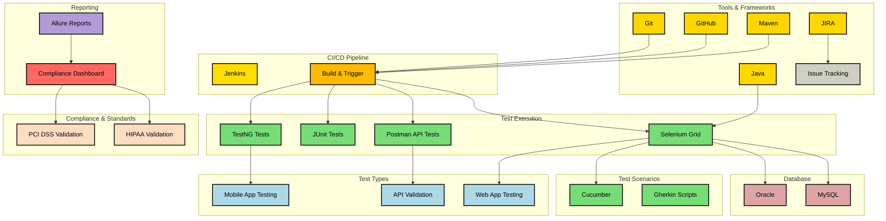
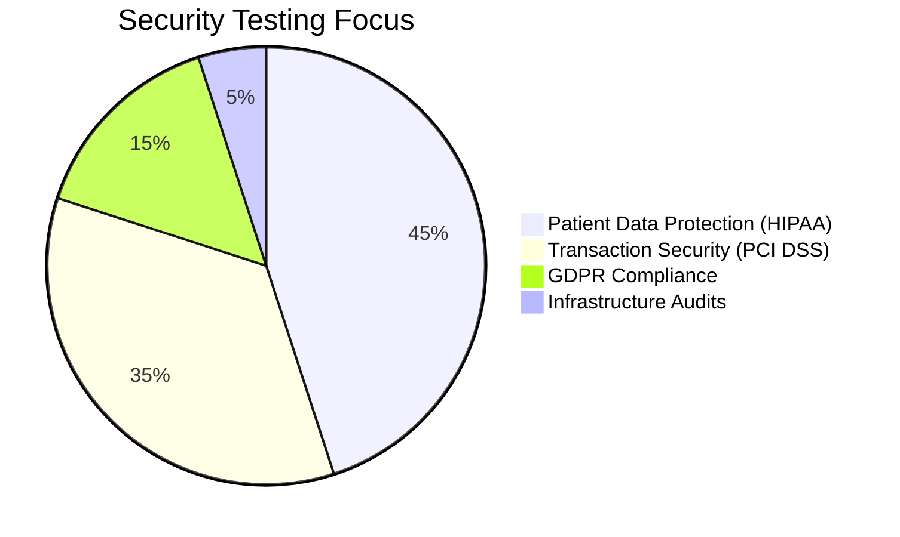

<!-- ╔══════════════════════════════════════════════════════════╗ -->
<!-- ║                  HEADER / HERO BANNER                   ║ -->
<!-- ╚══════════════════════════════════════════════════════════╝ -->

 

 

 

---

## 🙋 About Me

> *"Located at the crossroads of creativity and excellence — I build automation solutions that transform how products are tested and refined."*

I'm a **QA Automation Engineer & SDET** with enterprise experience at **CVS Health** and **Wells Fargo**, specializing in Selenium/Java BDD frameworks, API automation, compliance-grade testing, and CI/CD pipeline integration. I take pride in writing test automation that is not just functional — but resilient, scalable, and built to ship quality at speed.

- 🔬 **Automation-first mindset** — I don't just find bugs; I build systems that catch them automatically, every run
- 🏥 **Compliance-grade expertise** — Deep hands-on experience with HIPAA, PCI DSS, and HL7 healthcare data pipelines
- 🚀 **End-to-end ownership** — From test strategy and framework design to Jenkins CI/CD integration and Allure dashboards
- 👥 **Team multiplier** — Mentored 5+ engineers in automation best practices; drove QA strategy across 3+ concurrent Scrum teams
- 📚 **Always leveling up** — Pursuing B.S. in Information Technology (LA Pierce College, 2026) and actively exploring AI-powered test generation

---

## ⚡ Impact at a Glance

| 🕐 Execution Speed | 🛡️ Defects Prevented | ⚙️ CI/CD Uptime | 📈 Team Productivity | 💰 Annual Savings |
|:---:|:---:|:---:|:---:|:---:|
| **37.5% Faster** | **150+ Critical Bugs** | **99.9% Uptime** | **+20% Output** | **$15K+/year** |

---

## ⚙️ Technical Arsenal

<b>🧪 Testing Frameworks & Languages</b>

 

 

<b>🔧 Build, CI/CD & DevOps</b>

 

 

<b>📋 Project & Test Management</b>

 

 

<b>🗄️ Databases</b>

 

 

<b>📱 Mobile & Cross-Platform Testing</b>

 

 

<b>🖥️ OS & General Tools</b>

 

 

---

## 🎯 Core Competencies

---

## 💼 Professional Journey

  
<b>🏥 CVS Health &nbsp;—&nbsp; QA Automation Engineer</b>

   

  > *Healthcare giant · HIPAA-critical systems · 50K+ daily HL7 transactions*

  - ⚡ **Framework Innovation:** Architected a Selenium/Java BDD framework from the ground up, enabling consistent bi-weekly release cycles across healthcare products
  - 🛡️ **Compliance Mastery:** Automated HL7 data exchange validation handling **50,000+ daily transactions** with full HIPAA compliance coverage and audit-ready reporting
  - 🔄 **Pipeline Optimization:** Reduced post-deployment hotfixes by **25%** through tight Jenkins CI/CD integration across development, staging, and production pipelines
  - 👥 **Team Leadership:** Mentored **5+ engineers** in automation best practices, design patterns, and scalable framework architecture

   

  
<b>🏦 Wells Fargo &nbsp;—&nbsp; QA Automation Tester</b>

   

  > *Financial services · PCI DSS compliance · Multi-team Scrum environment*

  - 💳 **Financial Security:** Ensured PCI DSS compliance across high-volume transaction processing systems, preventing regulatory exposure
  - 🚀 **Regression Automation:** Automated **71% of regression test suites** using Selenium/TestNG — eliminating manual testing bottlenecks and accelerating sprint velocity
  - 📊 **Process Visibility:** Created real-time JIRA dashboards adopted by **3 Scrum teams** for sprint QA progress tracking
  - 💰 **Cost Savings:** Delivered **$15,000+/year** in savings by migrating brittle legacy test scripts to a maintainable, modular automation framework

   

  
<b>🔧 AutoZone &nbsp;—&nbsp; Manual QA Tester</b>

   

  > *Retail & e-commerce · REST API testing · Agile team contributor*

  - 🛠️ **Script Development:** Developed and maintained Selenium WebDriver scripts covering regression and functional test scenarios for web applications
  - 🔍 **API Testing:** Manually validated REST API responses via Postman — ensuring accuracy, schema adherence, and error handling correctness
  - 📈 **Agile Collaboration:** Used TestRail and Jira for end-to-end defect lifecycle management within Agile sprint cycles

   

---

## 🏗️ Automation Framework Architecture

---

## 🎓 Education & Certifications

### 🏛️ Academic Background

| Degree | Institution | Period | Relevant Coursework |
|--------|-------------|--------|---------------------|
| **B.S. Information Technology** *(Expected 2026)* | Los Angeles Pierce College | 2024 – 2026 | Secure Coding · QA Methodologies · Cloud Testing |
| **BA Political Science** | Aria University — Balkh, Afghanistan | Sept 2014 – June 2018 | Political Theory · Research Methods · Critical Analysis |

### 🏅 Professional Certifications

| Certification | Issuer | Focus Area |
|---------------|--------|------------|
| 🎖️ **SDET Automation Engineer** | Syntax Technologies | Java · Selenium · CI/CD · BDD Frameworks |

---

## 🗺️ Technical Roadmap

| Skill | Progress | Level |
|-------|----------|-------|
| **Web & Mobile Automation** *(Selenium · Appium)* | `🟦🟦🟦🟦🟦🟦🟦🟦🟦🟦` | Expert · 100% |
| **AI-Powered Test Generation** | `🟦🟦🟦🟦🟦🟦🟦🟦🟦⬜` | Advanced · 90% |
| **CI/CD Pipelines** *(Jenkins · GitHub Actions)* | `🟦🟦🟦🟦🟦🟦🟦⬜⬜⬜` | Proficient · 70% |
| **Containerization** *(Docker)* | `🟦🟦🟦🟦🟦🟦⬜⬜⬜⬜` | Intermediate · 60% |
| **BDD Methodology** *(Cucumber · TestNG)* | `🟦🟦🟦🟦🟦⬜⬜⬜⬜⬜` | Growing · 50% |

---

## 📊 GitHub Analytics

&nbsp;&nbsp;

 

---

## 🔒 Compliance Architecture

<b>Security & Compliance Testing Focus Areas</b>

 

---

## 🌐 Let's Connect

 

*👋 Open to QA Automation roles, SDET positions, and collaborative quality engineering projects. Let's build something that works — reliably, every time.*

 

